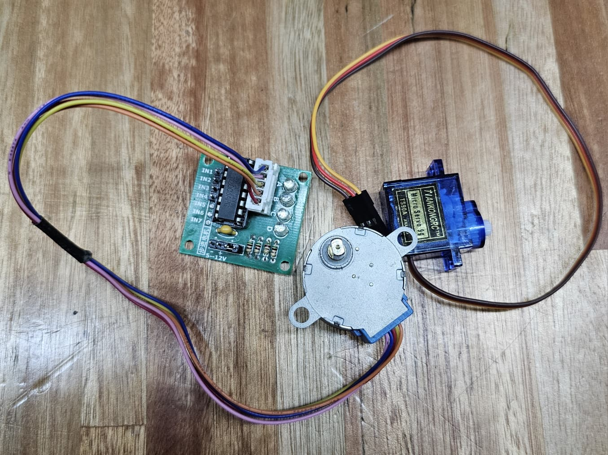

# Informe de Avance 2: Septiembre 2026

## 03/9/2026
**Tareas completadas:** Realizamos pruebas con un motor de pasos para evaluar si puede sustituir nuestro servomotor, con el fin de poder mover una tapa mas pesada y resistente.

## 10/9/2026
- [Realizar una descripción de los avances en el proyecto en la fecha en uno o dos párrafos]
- [Incluir:]
  - [Tareas completadas]
  - [Problemas encontrados y soluciones/alternativas propuestas]
  - [Próximos pasos]
  - [Imágenes o videos ilustrativos del avance]

## 17/9/2026
- [Realizar una descripción de los avances en el proyecto en la fecha en uno o dos párrafos]
- [Incluir:]
  - [Tareas completadas]
  - [Problemas encontrados y soluciones/alternativas propuestas]
  - [Próximos pasos]
  - [Imágenes o videos ilustrativos del avance]

## 24/9/2026
- [Realizar una descripción de los avances en el proyecto en la fecha en uno o dos párrafos]
- [Incluir:]
  - [Tareas completadas]
  - [Problemas encontrados y soluciones/alternativas propuestas]
  - [Próximos pasos]
  - [Imágenes o videos ilustrativos del avance]
